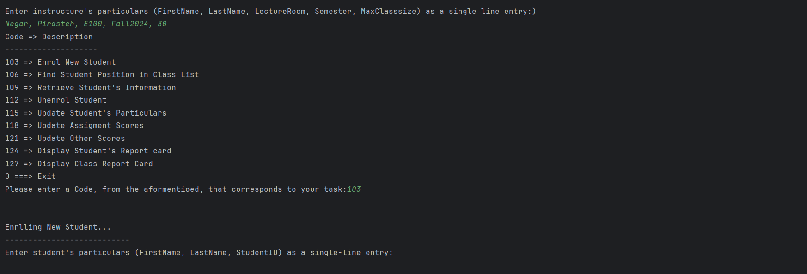

# **Classroom Management System** 📚  

A **Java-based console application** designed to simplify classroom management for instructors. This system supports student enrollment, score updates, and report generation with an intuitive menu-driven interface.

---

## **Features** 🚀  
- **Student Enrollment**: Add and manage student details effortlessly.  
- **Data Retrieval**: Retrieve student information, find their position, and display grades.  
- **Class Reports**: Generate detailed report cards for individual students or the entire class.  
- **Grade Management**: Update scores for assignments, labs, and exams dynamically.  
- **Interactive Console**: User-friendly interface with clear prompts and error handling.  

---

## **How It Works** 🛠️  

1. **Run the Program**:  
   Launch the program and follow the interactive prompts to perform classroom management tasks.

2. **Menu Navigation**:  
   Select tasks from the menu, such as adding a student (`103`), finding their position (`106`), or displaying reports (`127`).

3. **Dynamic Data Handling**:  
   Input student scores and retrieve grades or statistics on-demand.

---

### **Example Screenshot**  
  

> *A sample interaction showcasing student enrollment and menu navigation.*

---

## **How to Run the Project** 💻  

### **Prerequisites**  
- Java Development Kit (JDK) 8 or higher.  
- IntelliJ IDEA or any Java IDE.  

### **Steps to Run**  
1. Clone the repository:  
   ```bash  
   git clone https://github.com/your-repo/classroom-management  
   ```  

2. Open the project in IntelliJ IDEA.  
3. Ensure the `src` folder is marked as **Sources Root**.  
4. Build the project:  
   Go to **Build > Rebuild Project**.  
5. Run the program:  
   Right-click `Comp248secU_Dr.java` > **Run 'Comp248secU_Dr.main()'**.  

---

## **Menu Options** 📋  

```plaintext  
103 => Enrol New Student  
106 => Find Student Position in Class List  
109 => Retrieve Student's Information  
112 => Unenrol Student  
115 => Update Student's Particulars  
118 => Update Assignment Scores  
121 => Update Other Scores  
124 => Display Student's Report Card  
127 => Display Class Report Card  
0   => Exit  
```  

---

## **Technologies Used** 🖥️  
- **Language**: Java  
- **Development Environment**: IntelliJ IDEA  
- **Concepts Applied**:  
  - Object-Oriented Programming (OOP)  
  - Input Validation and Error Handling  
  - Dynamic Console Interactions  

---

## **Skills Demonstrated** 💡  
- **Object-Oriented Design**: Encapsulation and method-driven logic.  
- **Problem-Solving**: Built a functional system for classroom data management.  
- **Data Manipulation**: Handled student data using arrays and methods.  
- **Error Handling**: Validated inputs and guided users effectively.  

---

## **Future Improvements** ✨  
- **Data Persistence**: Store student data in a database or files for future sessions.  
- **Dynamic Structures**: Replace static arrays with dynamic structures like `ArrayList`.  
- **Modular Design**: Refactor into multiple classes for improved maintainability.  

---

### **About the Developer** 👩‍💻  
This project is a demonstration of my **Java development skills** and ability to create interactive, functional applications.  

---
